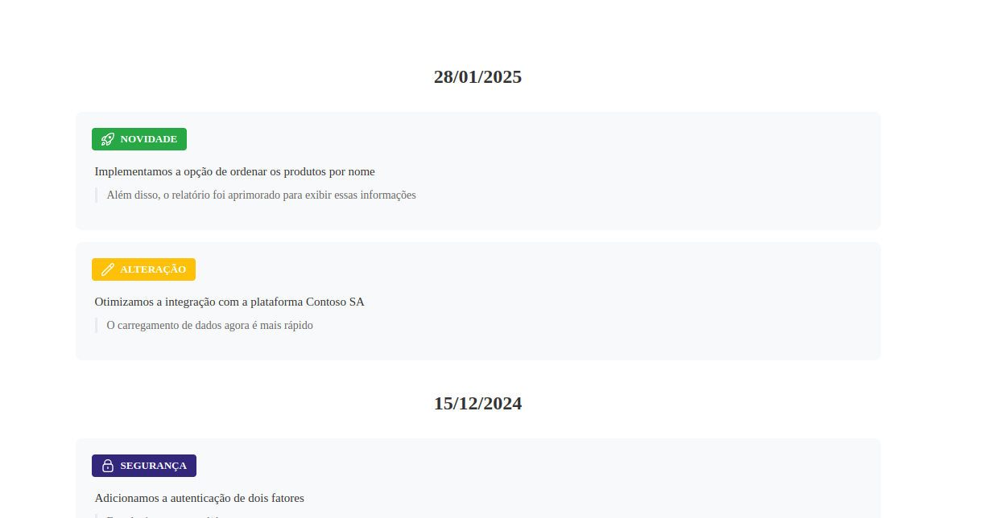

### :tada: F&MD .Net Changelog :tada:



## Installation

.Net Changelog can be installed through nuget

```shell
  nuget install Fmd.Net.Changelog
```

## Configuration

Add the following instructions in your Program.cs file

```csharp
//Add the path to the json file that will contain the changelog
builder.Services.AddChangelog(options =>
{
    options.JsonPath = Path.Combine(builder.Environment.WebRootPath, "json", "changelog.json");
});
```

```csharp
app.UseChangelog();
```

Add the json file to your project. The file should have the following structure:

```json
{
  "versions": [
    {
      "date": "28/01/2025",
      "changes": [
        {
          "type": "changed",
          "label": "ALTERAÇÃO",
          "icon": "lapis",
          "description": "Otimizamos a integração com a plataforma Contoso SA",
          "details": "O carregamento de dados agora é mais rápido"
        }
      ]
    }
  ]
}
```

## Customization

| Type     | Badge           |
|----------|-----------------|
| added    | badge-success   |
| changed  | badge-warning   |
| security | badge-security  |
| fix      | badge-fix       |
| default  | badge-secondary |

| Icon Name  | Icon                                      |
|------------|-------------------------------------------|
| definicoes |    |
| editar     |        |
| exclamacao |    |
| foguete    |       |
| lapis      |         |
| like       |          |
| megafone   |      |
| trancar    |       |

## Usage

Access the path /changelog in your application and you are ready to go!


